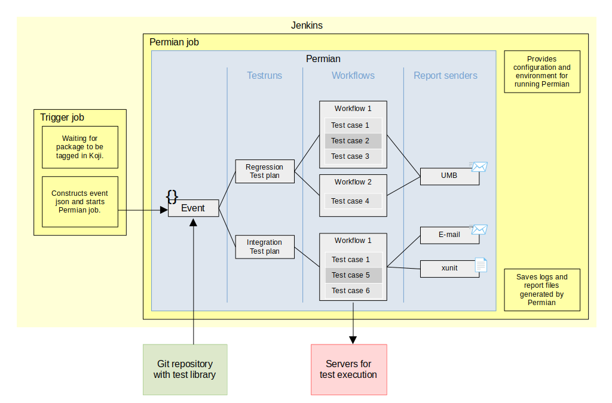

.. _quick start:

Quick start
===========

What is Permian
^^^^^^^^^^^^^^^

Permian is plugin based universal testing pipeline, that handles execution of various workflows
based on events and reporting of interim and final results.

Here is an simplified diagram of one of the possible deployments of Permian. Just to give
you an idea what Permian does.

First execution
^^^^^^^^^^^^^^^

We are going to run Permian in a container to avoid installing all its dependencies. In the example
bellow we are using special test plugin and test library, usually reserved for testing Permian itself.
The test plugin contains: :ref:`Event, EventStructure<usage events>`, Workflow and ReportSender that can all be used
without any configuration. 

1. Clone Permian repository::

    git clone https://github.com/rhinstaller/permian.git
    cd permian

2. Build container image for running Permian. This will create image with tag "permian"::

    ./build_container

3. Run Permian: We need to enable plugin `test`, specify path to testplan library and then
   we can use run_event command with event type `test` and `test` event structure::

    PIPELINEPLUGINS_ENABLE=test ./in_container ./pipeline -o library.directPath=./tests/test_library run_event '{"type": "test", "test": {"testplans": "testing plugin plan 2"}}'

.. note:: 
    In this case we use event structure `test` that directly specifies test plan name to run.
    But this isn't the case for normal event structures they instead should provide description
    of the test object. For example `koji` Event structure provides package name, new tag,
    build id, etc. and Permian then decides what test plans should be run based on the information
    in test library.

4. While Permian is running you can see the progress in WebUI, the URL will be printed like this::

    INFO:libpermian.webui.callbacks(Thread-2):WebUI started at: http://10.0.2.100:52805/

   Because we are running Permian in container, you have to change the printed IP to localhost.
   But in this case Permian will end before you can do that. Fortunately the WebUI is saved in
   static form after Permian ends. To view it we just have to start simple http server and
   open the url printed by the python command, usually http://0.0.0.0:8000/.::

    python3 -m http.server

.. note::
    Some tast cases in `testing plugin plan 2` are expected to fail.

Without container
^^^^^^^^^^^^^^^^^

Some plugins may use its own container to do stuff, and rather than working-out
the container in container issue it may be easier to run Permian outside container.
Following commands should work on latest Fedora.

1. Add beaker-client repo (if you do not have it already)::

    sudo dnf config-manager --add-repo https://beaker-project.org/yum/beaker-client-Fedora.repo
    sudo dnf config-manager --enable beaker-client

2. Install dependencies::

    sudo dnf install git make diffutils beaker-client \
        python3 python3-flask python3-requests \
        python3-libxml2 python3-yaml python3-magic \
        python3-pylint python3-bugzilla python3-productmd

3. Clone Permian::

    git clone https://github.com/rhinstaller/permian.git

4. Clone tplib::

    git clone https://github.com/rhinstaller/tplib.git

5. Same as in the example aboth we can try to run dummy test::

    cd permian
    PYTHONPATH=../tplib PIPELINEPLUGINS_ENABLE=test ./pipeline -o library.directPath=./tests/test_library run_event '{"type": "test", "test": {"testplans": "testing plugin plan 2"}}'

Next steps
^^^^^^^^^^

1. For more information see :ref:`Basic usage section<usage basic>` and documentation
   for individual plugins.
2. Create your settings file. Before you start using Permian properly you are likely
   going to change some of the default settings. See: :ref:`Settings section<usage settings>`
   of this documentation to learn how to do that. Description of all possible options
   can be found in default settings files or in this documentation.
3. Create a test library. Now its time to create your own test cases and organize
   them in test plans and requirements.
   See: :ref:`Test library section<usage library>`
4. Extend Permian with plugins (documentation TBD).
5. Setup CI. Permian was designed to be run inside CI systems like Jenkins.
